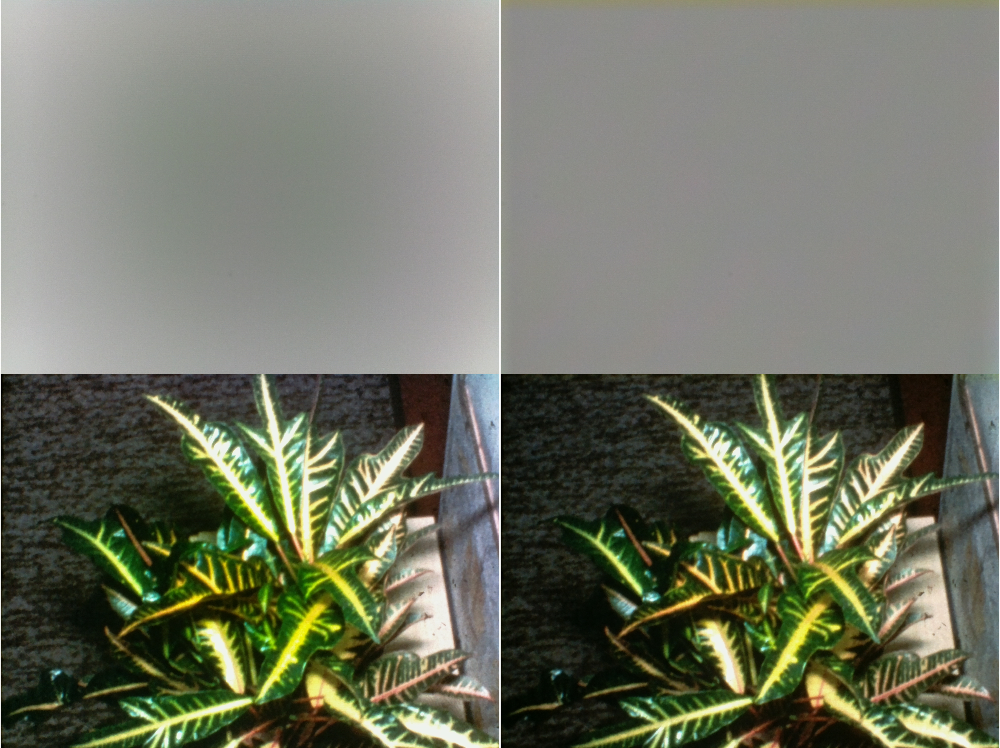
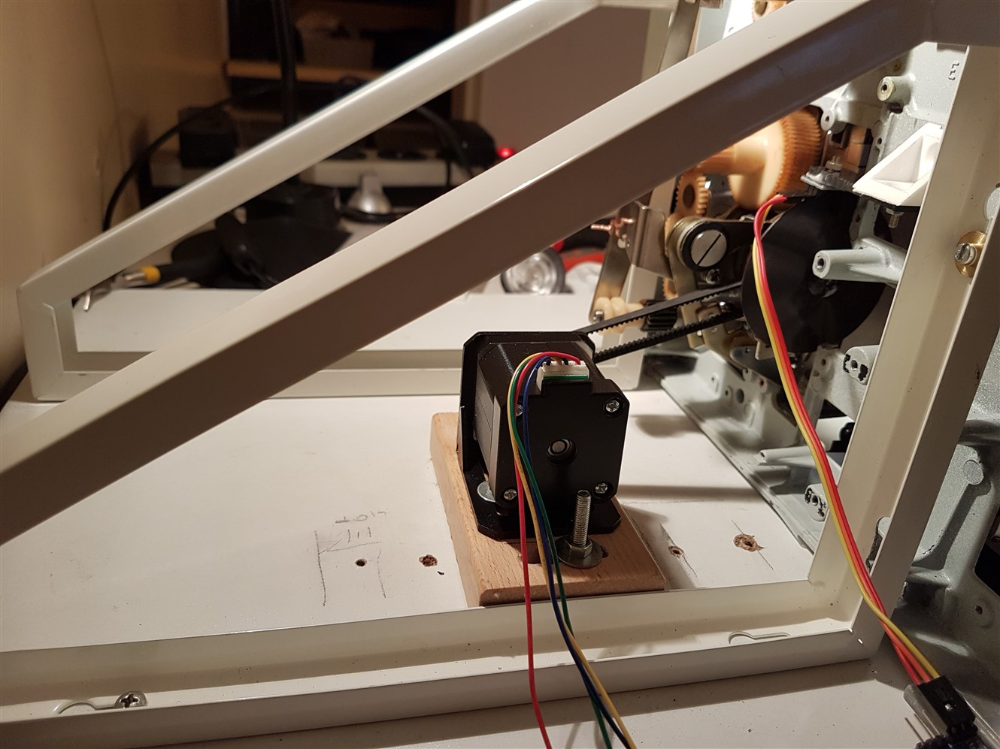
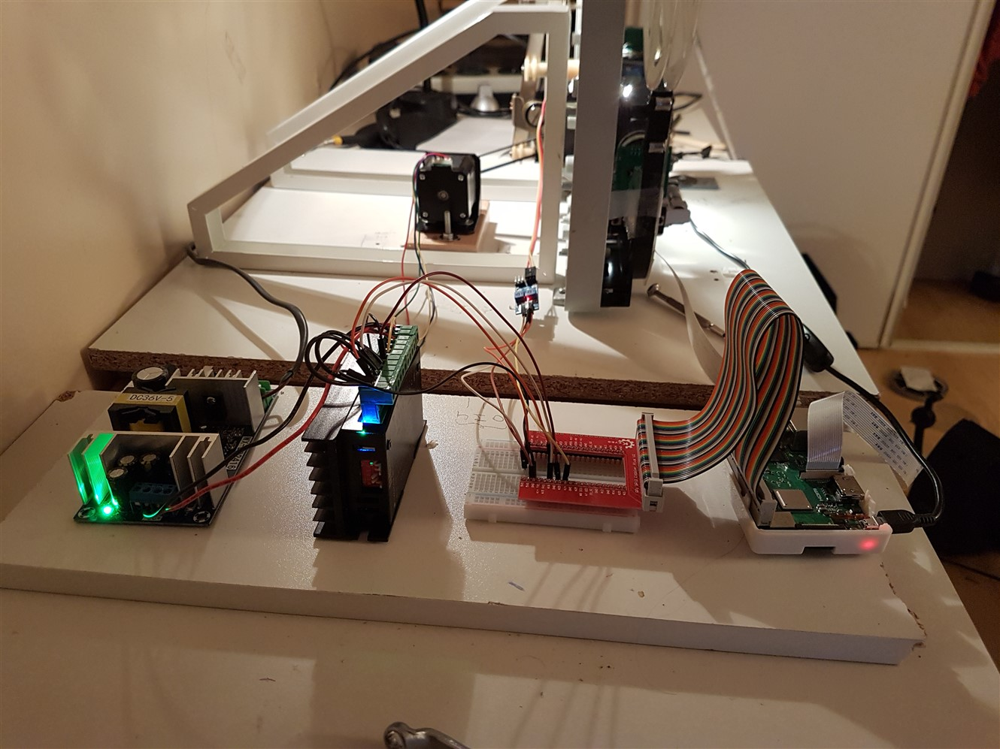
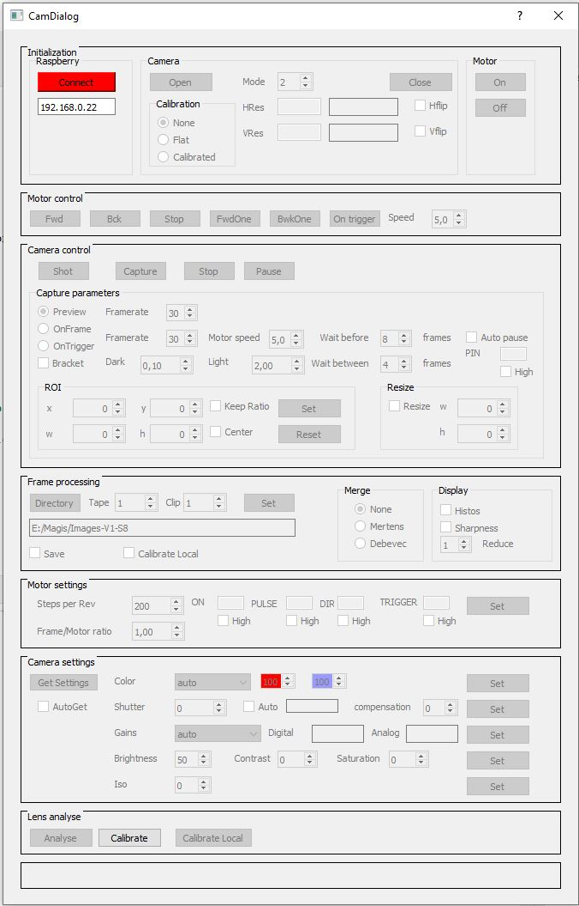

# Yet Another Raspberry Pi Telecine

En premier lieu je dois remercier Joe Herman pour son projet https://github.com/jphfilm/rpi-film-capture. Mon projet n'est pas un fork car toute la partie logicielle a été réécrite. Cependant toute la partie matérielle reprend les idées de Joe.

## Hardware

### Raspberry

Raspberry Modèle B+

### Caméra et optique

J'utilise une camera Raspberry V2 8MP NoIR Arducam avec monture CS. Il faut noter:

- ~~Un filtre infra-rouge n'est pas vraiment nécessaire pour une application Telecine, donc une camera NoIR convien~~t. Correction 21/04 Un filtre IR est absolument nécessaire
- Une caméra avec une monture CS ou M12 permet de choisir un objectif adapté. 

La taille de l'image 8mm est de 4,5mmx3mm, celle du capteur IMX219 3,68x2,67mm. Le grandissement n'est pas très différent de 1. Donc la distance du centre de l'objectif à l'image et du centre de l'objectif au capteur sont à peu près deux fois la distance focale. La distance de l'image au capteur à peu près quatre fois la distance focale. C'est pourquoi j'ai choisi un objectif de 35mm. Dans mon cas il faut 30mm de bagues d'extension CS. La caméra est montée à l'emplacement de la lampe du projecteur. Une table millimétrique permet une mise au point précise. Ci dessous le calcul optique:

- Image film 8mm 4,5x3,3 mm Capteur IMX219 3,68x2,76mm Grossissement 0,81 
- Distance bague de l'objectif/Capteur 46mm Distance Face avant de l'objectif/Image 61mm
- Distance totale Image/capteur 141 mm

L'objectif de la camera Raspberry est collé et non adéquat pour la macrophotographie, c'est pourquoi j'ai choisi un autre objectif. Il semble aussi possible de décoller et régler cet objectif et de lui ajouter une lentille additionnelle.

### Camera V1 ou V2 ? Calibration

Utilisées avec un objectif non stock, les caméras V1 et V2 nécessitent une correction de calibration ( mais elles se comportent tout à fait différemment.

- La caméra V1 nécessite peu de calibration, seul un rond central est moins lumineux.
- La caméra V2 présente une dérive des couleurs à l'extérieur du rond central

Après calibration l'image est correcte dans les deux cas mais pour la V2 même avec une calibration soignée certaines images présentent un rond central plus jaune.

Ci-dessous :
Image blanche non calibrée et calibrée
Image non calibrée et calibrée (noter la dérive centrale pour la V2)

Pour la V1




Pour la V2


La caméra V1 semble un meilleur choix

### Lampe, Diffuseur

J'ai de bon résultats avec une LED TrueColor Phillips faisceau étroit 4000K. Il faut faire des expériences avec des diffuseurs, un diffuseur à la surface de la LED réduit l'intensité lumineuse. Un diffuseur proche du film  apporte un certain flou, ce flou peut-être intéressant pour diminuer l'effet des rayures ou des craquelures du film mais au prix d'une perte de netteté donc il doit être assez léger.

 J'ai aussi placé un diffuseur à la surface de la LED.  Il faut ajuster le diffuseur et la distance de la lampe pour avoir une durée d'exposition convenable. Si la caméra fonctionne à 30fps l'exposition maximum est de 33333 micro seconds. Si le bracketing (cf infra) est utilisé il faut que l'exposition auto sur une image normale soit d'environ 2000 à 3000 micro-seconds.

  ### Projecteur, Trigger, Moteur

Mon projecteur est un Elmo GP, il faut enlever toutes les parties électriques et conserver uniquement le mécanisme d'avancement du film. Il faut enlever la pale avec les trois fenêtres et la remplacer par un disque avec un capteur "trigger" qui se déclenche quand l'image est bien positionnée dans la fenêtre de projection. J'utilise un capteur optique qui se déclenche au passage d'un petit trou dans le disque.

Si possible agrandir au maximum ou supprimer la fenêtre de projection pour capturer la totalité de l'image.

Le moteur pas à pas est un moteur NEMA 17 alimenté en 24v. Comme contrôleur j'ai choisi un TB6600 qui présente certains avantages, les hauts voltages sont bien séparés des broches du Pi (moins dangereux pour le Pi !), les broches sont protégées par des coupleurs optiques et le micro-stepping et l'intensité sont contrôlables par des switchs 

Le moteur entraine l'axe du projecteur par des poulies GT, avec un ratio de 1:1

Maintenant quelques images:

Le projecteur, la caméra et la lampe. Une petite table micrométrique permet une mise au point précise.


Le moteur et le disque avec le capteur optique. Les équerres pour rigidifier et éviter les vibrations.



De gauche à droite: Alimentation 24v, Contrôleur TB6600, breadboard et Raspberry et son alimentation 5V



## Software

L'application Python reprend l'idée de Joe, une application client-serveur communiquant par le réseau. L'application sur le Raspberry contrôle le moteur et la caméra, les images capturées sont envoyées à l'application sur un PC windows pour traitement et sauvegarde. Le GUI de l'application windows envoie des commandes à l'application Pi et reçoit des réponses. Maintenant quelques détails d'implémentation.

### Programmation réseau

Le mécanisme des sockets est utilisé pour la communication réseau. Une classe `MessageSocket` permet sur un socket des envois ou réceptions orientés objet

- Envoi et réception d'un buffer
- Envoi et réception de string
- Envoi et réception d'un objet python quelconque (dictionnary, tuple, ...)

Ainsi on peut aisément envoyer ou recevoir sur ce socket toute sorte d'objets Python, commande et ses paramètres, réponse, dictionnaire d'attributs, header de frame avec des informations, image JPEG ou tableau numpy

Deux sockets sont utilisés, un socket bidirectionnel pour envoyer des commandes et recevoir des réponses et un socket unidirectionnel pour recevoir les frames et des headers d'information.

### Attributs d'objet

L'objet camera et l'objet motor ont des attributs de propriétés. Des méthodes génériques get et set permettent d'y accéder. Ces attributs sont sauvegardés sous forme de dictionnaires python avec Numpy (fichiers npz). Les objets dictionnaires d'attributs peuvent aussi être transmis sur le réseau. Ces méthodes génériques permettent facilement de gérer un grand nombre d'attributs sans alourdir la programmation.

### Moteur

On utilise la librairie pigpio qui permet de générer les pulses PWM par hardware en dehors de l'application Python. C'est plus précis et ne ralentit pas l'application. La librairie pigpio permet aussi dé démarrer le moteur en contrôlant l'accélération pour éviter de le bloquer (ramping).  Le moteur peut fonctionner en continu à une certaine vitesse ou bien en discontinu frame by frame avec arrêt sur le trigger.

Câblage du moteur

Deux broches sont absolument nécessaires PUL/STEP et DIR
Unr broche supplémentaire ENA ou RESET peut être utilisée pour mettre le moteur ON/OFF. En fait il n'y a pas d'inconvénient à le laisser sous tension si ce n'est que son couple empêche d'avancer le projecteur manuellement.

Contrôleur TB6600

ENA- PUL- DIR- to GND
ENA+ DIR+ PUL+ To Pi GPIO 
Si ENA+ HIGH le moteur est Off Line 

Contrôleur DRV8825

STEP DIR and SLEEP to Pi GPIO
RESET non utilisé à connecter sur Pi VDD 3.3V
Si SLEEP est HIGH le moteur est On Line

Un moteur pas à pas fonctionne en général à 200 pulses par tour. Utiliser le micro-stepping par exemple à 800 pulses par tour peut diminuer les vibrations

### Camera	

Bien entendu on utilise la librairie Python picamera. Cependant comme indiqué plus haut la camera V2 avec un objectif non d'origine produit une image très mauvaise. Il est absolument nécessaire de calibrer l'objectif en construisant une table de correction `lens_shading_table`. Cette modification n'est pas encore comprise dans la version actuelle de la librairie, il faut donc  installer et utiliser une version spéciale de la librairie., On pourra se référer au projet:

https://github.com/rwb27/openflexure_microscope_software

La capture s'effectue en JPEG sur le port video 

Comme expliqué dans la documentation picamera on utilise la méthode la plus rapide `capture_sequence` avec un générateur. 

https://picamera.readthedocs.io/en/release-1.13/

En théorie dans le générateur deux méthodes de capture sont possibles

#### Capture "On frame"

Le moteur est asservi à la capture

```
Tant que captureEvent
	Avancer le moteur jusqu'au trigger
	Capturer la frame
	Envoyer la frame sur le réseau
```

#### Capture "On trigger"

La capture est asservie au moteur

```
Démarrer le moteur à une certaine vitesse
Tant que captureEvent
	Attendre le trigger
	Capturer la frame
	Envoyer la frame sur le réseau
```

Dans la première méthode le moteur avance de façon discontinue, frame par frame, dans la seconde il tourne à vitesse constate, le trigger déclenche la capture. 	

### Paramètres de la caméra, Bracketing, Merge, HDR

En premier lieu, il faut souligner que la librairie picamera fait un excellent travail pour la qualité de l'image. <u>L'exposition et la balance des blancs automatiques sont très bien calculées</u>, il est difficile et donc pas nécessaire de faire mieux manuellement. Donc laisser la caméra en automatique

Cependant la camera est limitée dans sa dynamique, si on augmente l'exposition pour éclaircir les sombres, il n'y a plus de détails dans les clairs et inversement. Il est pratiquement impossible d'obtenir une image qui reflète correctement toutes les luminosités de la scène.

C'est pourquoi il est absolument nécessaire de reprendre l'idée de Joe et de capturer chaque image avec différentes expositions (bracketing), une sous-exposée pour obtenir les clairs, une surexposée pour obtenir les sombres et une normale, avant de les fusionner. Ce traitement sera fait coté PC avec la librairie openCV.

Plusieurs algorithmes de fusion Merge/HDR sont disponibles. Le plus simple utilisé par Joe est le Merge Mertens, les pixels sont fusionnés en ignorant les pixels trop blancs ou trop noirs.L'inconvénient de cette méthode est de donner une image un peu artificielle qui ne rend pas compte des luminosités réelles.

Les algorithmes de vrai HDR tentent de rendre compte de ce que verrait un œil humain en corrigeant l'imperfection de la caméra. Pour moi ils donnent un meilleur résultat, par contre ils nécessitent d'avoir le temps d'exposition de chaque image. Il ne sont pas plus consommateurs en CPU.

On peut se référer à :
[https://www.learnopencv.com/high-dynamic-range-hdr-imaging-using-opencv-cpp…](https://www.learnopencv.com/high-dynamic-range-hdr-imaging-using-opencv-cpp-python/)
et
<https://www.learnopencv.com/exposure-fusion-using-opencv-cpp-python/>

Comme exemple, ci-dessous la même image avec 25 expositions également réparties en luminosité. On constate que <u>aucune image n'est vraiment satisfaisante</u>. Quand on commence à voir le fond sombre les blancs sont surexposés. la dernière image bien meilleure est le résultat d'un merge HDR (MergeDebevec et TonemapReinhard)


Autre exemple, l'image sous-exposée,  l'image avec l'exposition automatique, l'image sur-exposée puis l'image merge Mertens et l'image HDR. L'image Mertens est un peu artificielle car elle ne rend pas compte de la luminosité réelle de la scène, les sombres sont exagérément accentués. On constate également que le merge Debevec réduit le grain par contre elle manque de contraste ce qui pourra être amélioré au post-traitement.


​                                                              Bracket de 3 Merge Mertens et Merge Debevec

###### Note sur les algorithmes de fusion HDR et de Tone Mapping

La littérature est abondante sur le sujet. J'ai fait divers essais et le meilleur résultat est obtenu avec un MergeDebevec et un ToneMap Durand. Normalement le merge Debevec devrait prendre en compte la courbe de réponse de la caméra mais cela ne donne pas de bons résultats. Je suspecte que les images JPEG reçues de la caméra ne sont pas la vraie réponse du capteur mais sont traitées, en particulier ajustées en gamma. Le merge utilisé dans l'application prend en compte une réponse linéaire. 

###### Mise en œuvre du merge

D'après mon expérience par rapport a l'exposition automatique calculée par la caméra t, l'exposition sous exposée peut être de 0.1xt et l'exposition sur exposée de 8*t. ces facteurs sont assez stables sur la durée de la capture.

D'un point de vue programmation la mise en œuvre du bracketing est très délicate, en effet il faut bien avoir l'idée que la caméra n'est pas un appareil photo mais une caméra qui fournit un flux continu d'images.  Donc après avoir changé l'exposition il faut attendre quelques frames (minimum 4 d'après mon expérience) avant d'obtenir la bonne exposition. De même après  être repassé en automatique il faut attendre quelques trames (minimum 7 d'après mon expérience) avant d'avoir la bonne exposition. La capture devient:

```
Tant que captureEvent
	Avancer le moteur jusqu'au trigger
	Attendre 7 frames
	Répéter 3 fois
		Changer l'exposition
		Capturer la frame
		Envoyer la frame sur le réseau
		Attendre 4 frames
	Repasser en exposition automatique
```

Tout ceci diminue considérablement la vitesse de capture, avec la résolution 1640x1232 elle ne dépasse plus 1s par trame et en résolution 3280x2664 3s par trame

### GUI on the PC

Comme dans le projet de Joe le GUI sur le PC Windows est réalisé avec PyQt5

### Multithreading Multiprocessing

Ces deux techniques ont de buts différents. Un traitement multithread permet d'effectuer simultanément des opérations d'entrée-sortie sans bloquer l'application. Un traitement multiprocessus permet de tirer partie des différent cores du processeur. Noter que normalement des thread pourraient exécuter du code simultanément mais ce n'est pas possible en Python, donc en Python les threads sont pour des applications intensives en IO et les processus pour des applications intensives en CPU.

Sur le Pi aucun traitement intensif en CPU n'est effectué, le contrôle du moteur et du trigger sont effectués en dehors de l'application par pigpio donc le multiprocessus ne s'impose pas. Par contre pour pouvoir effectuer concurremment la capture et l'envoi sur le réseau le multithread est indispensable. Donc sur le Pi on a les threads suivants

- La thread principale avec la boucle de réception des commandes
- La thread de capture
- La thread d'envoi des trames sur le réseau

La communication entre les deux threads est assurée par une Queue d'images et de headers

Sur le PC windows le GUI est réalisé avec Qt on a les threads suivants		

- La thread principale avec la boucle d'évènements de Qt, envoi des commandes et réception des réponses.
- Une thread pour recevoir et traiter les images

Ici aussi on pourrait avoir une thread de réception et une thread de traitement mais ce n'est pas vraiment nécessaire. Le multiprocessus n'est pas non plus nécessaire car le PC est suffisamment puissant.

Il est intéressant de noter que le réseau n'est pas un facteur limitant, avec la résolution 1640x1232 et une capture à 1fps, le débit réseau est d'environ 20mb/s. L'interface réseau du Raspberry est indiquée comme 1Gb/s mais en réalité elle utilise le bus USB donc plus lente.

## Installation and setup

L'application nécessite python 3 sur le PC et sur le Pi

Sur le PC Windows

- Python 3.7
- matplotlib        pip3 install mathplotlib
- numpy              pip3 install numpy
- openCV             pip3 install opencv-python
- PyQt5                 pip3 install PyQt5

Si on utilise l'IDE Thonny, il est préférable de l'installer dans Python lui-même plutôt que d'installer la version qui comprend une autre installation de Python:

- pip3 install thonnyapp

Sur le Pi raspian:

- Python 3.7
- numpy
- pigpio
- picamera (version expérimentale)

## Usage

Ci-dessous l'image de l'interface de l'application sur le PC



### Exécuter l'application

- Sur le PC dans le répertoire GUIControl exécuter: python TelecineApplication.py

- Sur le Raspberry exécuter le démon  pigpiod : sudo pigpiod

- Sur le Raspberry dans le répertoire Raspberry exécuter: python3 Controller.py

- Sur le PC saisir l'adresse IP du Raspberry et cliquer "Connect"


### Ouvrir la camera

Le plus simple est de choisir un sensor_mode prédéfini 

https://picamera.readthedocs.io/en/release-1.13/fov.html#sensor-modes

La résolution sera alors la résolution par défaut de ce mode. On peut aussi spécifier la résolution désirée.

On peut ouvrir la caméra avec ou sans calibration, ce qui permet de constater la différence.

### Calibrer la caméra

Le bouton "Calibrate" exécute le programme de calibration repris du projet openflexure cité ci-dessus. Il crée un fichier calibrate.npz qui contient la lens_shading_table et qui sera utilisé à la prochaine ouverture de la caméra.

Pour calibrer il faut capturer une image <u>uniformément blanche</u> (pas de cadre noir par exemple). Personnellement  je place un diffuseur blanc devant la fenêtre du film et je mets la caméra un peu hors focus

### Contrôle du moteur

En premier lieu paramétrer le nombre de steps par révolution, le ratio des poulies Moteur/Projecteur  et les numéros de pins. Pour chaque pin choisir le niveau du signal HIGH ou LOW.

La pin ON contrôle le moteur ON/OFF

Par exemple pour le TB600
ON correspond à la pin ENA+ level LOW
PULSE correspond à la pin PUL+ level HIGH
DIR correspond à la pin DIR+ choisir level pour avoir le bon sens de rotation

Pour le DRV8825
ON correspond à la pin SLEEP level HIGH
PULSE correspond à la pin STEP level HIGH
DIR correspond à la pin DIR choisir level pour avoir le bon sens de rotation

 Le niveau HIGH ou LOW de la pin TRIGGER dépend du senseur utilisé
Par exemple pour mon capteur optique le niveau est LOW quand le trou est détecté.

Le moteur peut tourner en avant ou en arrière à une certaine vitesse ou par image

### Paramètres de la caméra

On peut ajuster les paramètres de la caméra, cependant les meilleurs résultats sont obtenus en laissant les paramètres automatiques, color auto (automatic white balance) et shutter_speed  0 (automatic exposure). 

### Capture

Shot: Capture une image (sans bracket)

- Preview: Capture sans moteur, utile pour tester la mise au point, les paramètres de la caméra et le bracket
- Capture: Capture en avançant le moteur. 

"On Frame" Le moteur avance jusqu'au trigger, stoppe puis capture
"On trigger" Le moteur avance de façon continue à une certaine vitesse, la capture est déclenchée par le trigger

La méthode "On frame" est plus fiable surtout si le bracket est utilisé.

### Bracketing et fusion

La capture peut d'effectuer sans bracket une exposition par image ou bien avec un bracket de trois expositions par image. 

Si un bracket de 3 est choisi il faut ajuster:

- "Dark coefficient" coefficient à appliquer à l'exposition de l'image normale (auto exposition calculée par la caméra) pour obtenir l'image sous-exposée. 0.10 semble être une bonne valeur
- "Light coefficient" coefficient à appliquer à l'exposition de l'image normale (auto exposition calculée par la caméra) pour obtenir l'image sur-exposée. 8 semble être une bonne valeur
- "Shutter speed wait" Nombre de trames à ignorer après le changement d'exposition (minimum 4)
- "Shutter auto wait" Nombre de trames à ignorer après le passage en auto pour l'image suivante (minimum 7). 

Pour ajuster ces coefficients il faut faire des essais sur une image dans votre film. 

Sans "Merge" mais avec "Save" choisir "Preview" framerate 30fps

- Vous devez bien voir dans le répertoire de sauvegarde les trois images dans l'ordre (sous-exposée, sur-exposée, normale) sinon il faut augmenter "Shutter speed wait" pour laisser le temps à la caméra d'ajuster l'exposition.
- De plus l'exposition auto de la trame normale doit être stable, sinon il faut augmenter "Shutter auto wait" pour laisser le temps à la caméra de revenir en exposition automatique.

Avec "Merge" vous pouvez ensuite constater l'effet de la fusion

Ensuite vous pouvez faire les mêmes essais en "Capture"

- Vérifier également que lorsque le moteur  s'arrête l'image normale n'est pas bougée (blurred) . Sinon il faut augmenter "Shutter auto wait" pour attendre la stabilisation totale après l'avance du moteur.

Au final avec un bracket de 3 et un framerate  camera de 30fps vous devez obtenir un débit d'environ 1 seconde par image en résolution 1640x1232  et 3 secondes par image en résolution maximale 3280*2464 

### Traitement des images

Il s'effectue sur le PC

- "Histo" affiche l'histogramme de l'image
- "Sharpness" Evalue et affiche la netteté de l'image pour une bonne mise au point (utiliser "Shot" ou "Play" avec 5fps) . La meilleur mise au point correspond à la valeur maximum de sharpness. L'amorce blanche au début du film permet de bien tester la mise au point.
- Reduce permet de réduire l'image affichée
- "Merge"  Détermine l'algorithme de fusion "None"  "Mertens" ou "Debevec"
- "Save" Sauvegarde les images dans le répertoire choisi. On peut choisir un numéro de bande et un numéro de clip. Pour chaque "Capture" les images sont numérotées à partir de 0

### Post Traitement

Après la capture pour créer un fichier MJPEG (sans réencodage)

 	ffmpeg -framerate 16 -start_number 00000  -i image_%05d.jpg -codec copy 17_01.avi

Pour regrouper des clips:

​	ffmpeg -i "concat:17_01.avi|17_02.avi" -c copy 17.avi

Pour la restauration, stabilisation, cleaning, degrain, sharpness, final white balance and levels, interpolating or blending, ... voir les scripts avisynth de videofred

​	https://forum.doom9.org/showthread.php?t=144271

C'est un peu ancien mais cela reste une référence.

Encodage direct en sortie du script en AVC ou HEVC avec MeGui

Ou bien sûr tout autre éditeur Video


​	
​	
​	
​	
​		